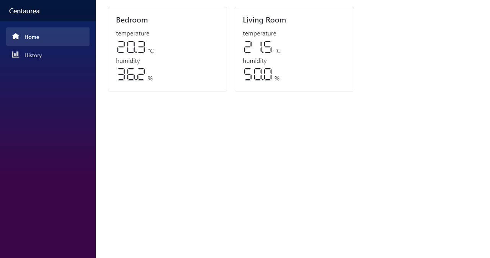
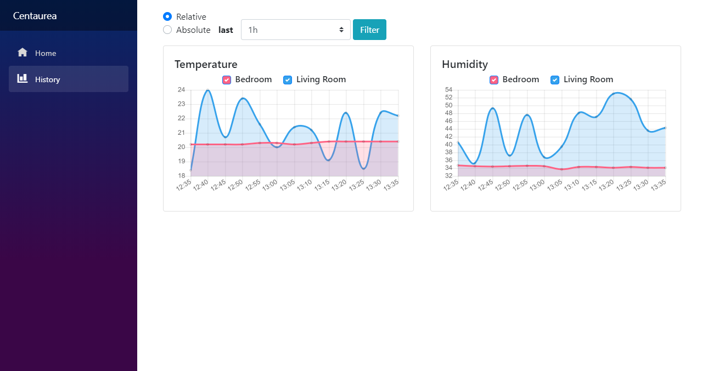

# IotHome.Service [](https://github.com/jjankowski87/IotHome.Service/actions)
Web dashboard for displaying actual and historical sensor readings.
Sensor devices sends data to Azure IoT Hub, which then redirects them to Azure Blob Storage. Storage is monitored by Azure Function which notifies web application about new readings.

### Technologies
* .NET Core 3
* Blazor Web Server
* Blazorise
* Azure IoT Hub
* Azure Storage
* Azure Function

### User Interface



### Sensors
* Humidity and temperature sensor on ESP8266 module ([repository link](https://github.com/jjankowski87/IotHome.ESP8266Sensor))
* Temperature sensor on RaspberryPi3 ([repository link](https://github.com/jjankowski87/IotHome.RaspberryPi))

### Configuration
Provide following configuration before running web application (```appsettings.json``` file):
* ```ConnectionString``` to Azure IoT hub. Can be found in Azure Portal -> IoT Hub -> Shared access policies -> iothubowner -> Connection string—primary key.
* ```ContainerName``` name of container in Azure Blob service, note that it should be ADLS Gen 2 account type as it supports hierarchical file system.
* ```ParentDirectory``` directory where readings are stored.

## Readings Notifier
Blob storage is monitored by ```IotHome.Service.ReadingsMonitor``` Azure Function. To enable automatic page refresh when new readings appears, use this project. It uses Event Grid trigger instead of Blob trigger, because the latter one had significant delays.
### Configuration
* ```StorageContainerName``` and ```StorageDirectory``` are the same properties as in web app configuration.
* ```BlobStorageConnectionString``` to Blob Storage. Can be found in Azure Portal -> Storage account -> Access keys.
